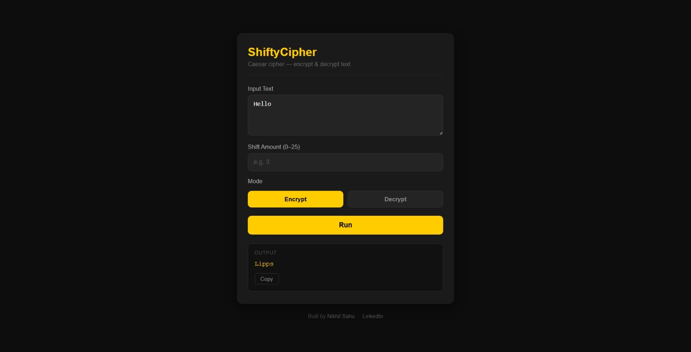
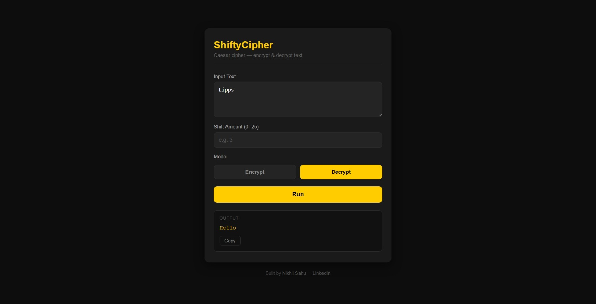

# ShiftyCipher — Caesar Cipher Tool

A simple web-based Caesar cipher tool built with Python and Flask. Supports both encryption and decryption with a custom shift value.

---

## What is a Caesar Cipher?

A Caesar cipher is one of the oldest encryption techniques. Each letter in the text is shifted by a fixed number of positions in the alphabet. For example, with a shift of 3: `A → D`, `B → E`, `Z → C`.

It's commonly used in CTF challenges and as an introduction to classical cryptography.

---

## Features

- Encrypt and decrypt text using Caesar cipher
- Custom shift value (0–25)
- Non-alphabetic characters (numbers, symbols, spaces) are preserved
- Copy output with one click
- Input validation and error handling
- Deployable to Vercel

### Encrypt Mode


### Decrypt Mode


---

## Setup

```bash
git clone https://github.com/heynick1337/ShiftyCipher.git
cd ShiftyCipher
pip install -r requirements.txt
python app.py
```

Open `http://localhost:5000`

---

## Deploy to Vercel

```bash
npm i -g vercel
vercel
```

---

## Project Structure

```
ShiftyCipher/
├── app.py              # Flask backend
├── requirements.txt
├── vercel.json         # Vercel deployment config
├── .gitignore
├── README.md
└── templates/
    └── index.html      # Frontend UI
```

---

## Author

**Nikhil Sahu**
- GitHub: [github.com/heynick1337](https://github.com/heynick1337)
- LinkedIn: [linkedin.com/in/sahunikhil01](https://linkedin.com/in/sahunikhil01)
